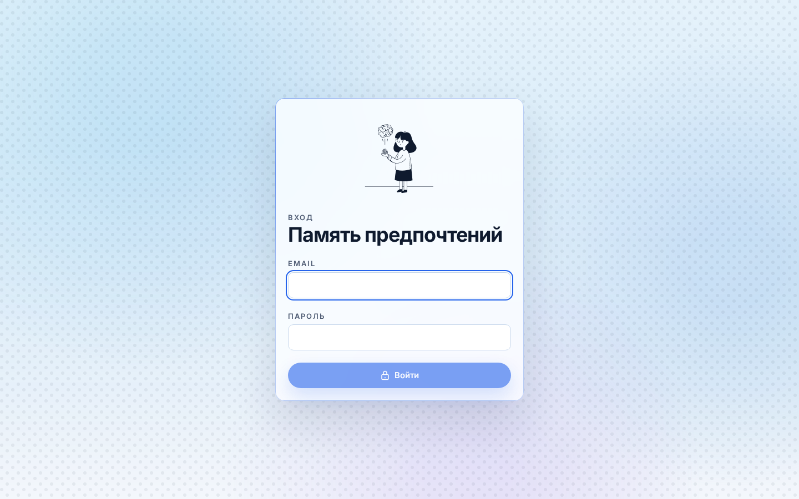
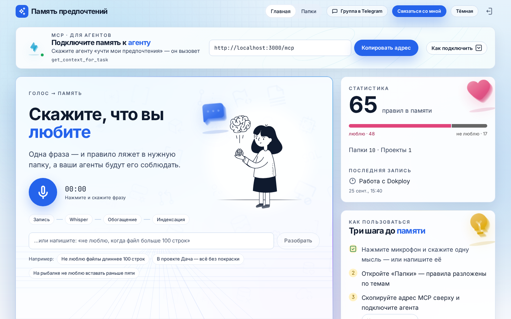
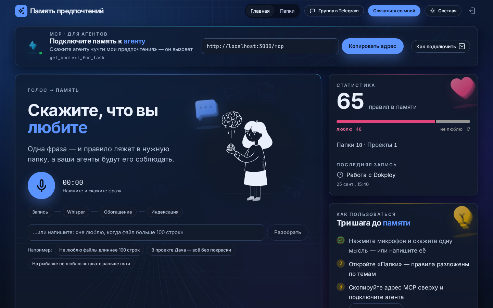
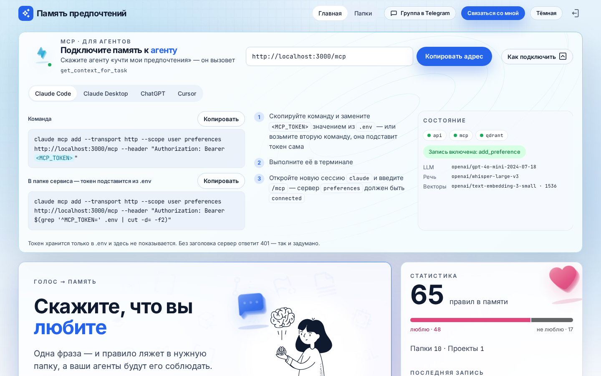
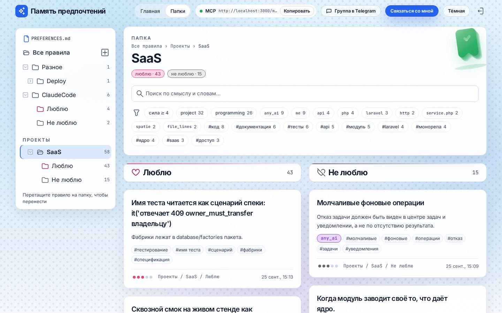
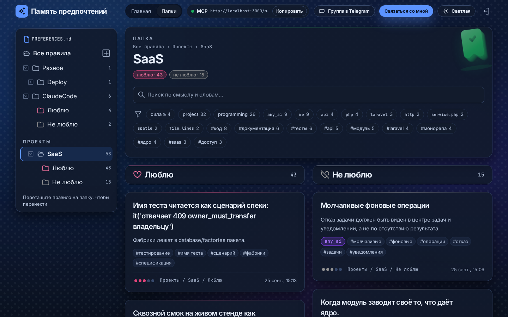
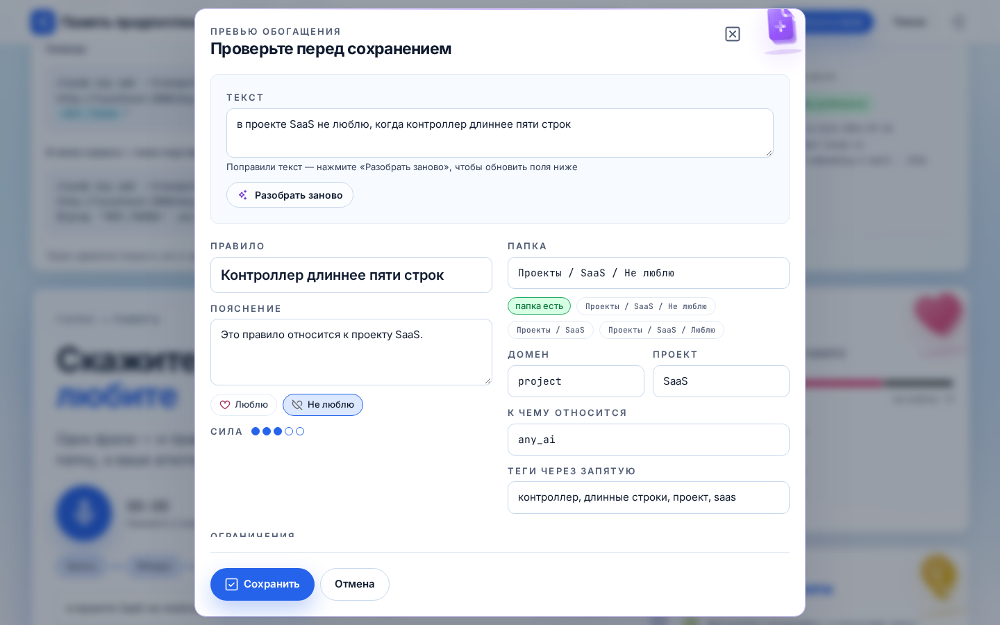
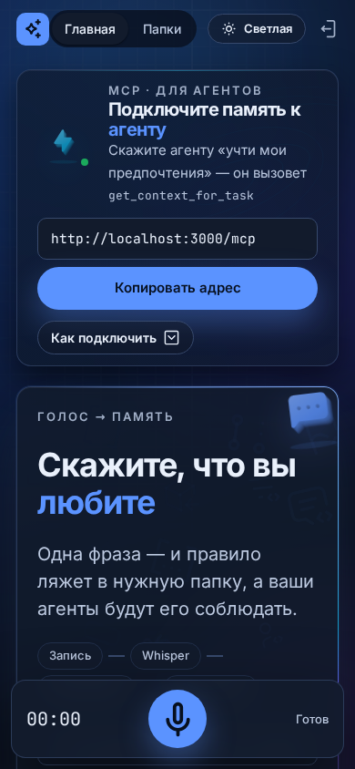
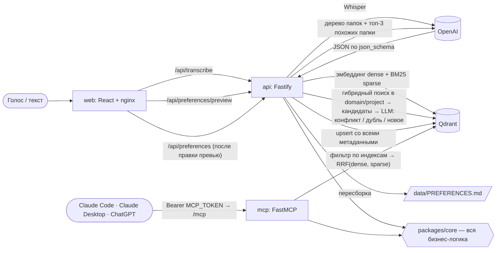

# Сервис моих предпочтений (preference-memory)

Личная память «люблю / не люблю» на любые темы: код, ИИ-ассистенты, рыбалка, путешествия, конкретные проекты.
Вы говорите фразу голосом или пишете текстом — сервис раскладывает её в структуру (правило, полярность, папка,
домен, проект, теги, ограничения, сила), кладёт в дерево папок, индексирует в Qdrant и собирает главный файл
`PREFERENCES.md`. Агенты (Claude Code, Claude Desktop, ChatGPT) читают всё это через MCP-сервер.

## Demo

| Вход (email + пароль из `.env`) | Главная, светлая тема |
|---|---|
|  |  |
| **Главная, тёмная тема** | **Подключение агентов к MCP** |
|  |  |
| **Папки: проект SaaS** | **Папки, тёмная тема** |
|  |  |
| **Превью перед сохранением** | **Телефон** |
|  |  |

## Запуск

1. Скопируйте шаблон и заполните его:
   ```bash
   cp .env.example .env
   ```
   Обязательны четыре переменные: `OPENAI_API_KEY`, `MCP_TOKEN` (любая случайная строка от 16 символов, например
   вывод `openssl rand -base64 32`), `ADMIN_EMAIL` и `ADMIN_PASSWORD` (вход в веб-интерфейс, пароль от 8 символов).
2. Запустите:
   ```bash
   docker compose up -d --build
   ```
3. Откройте `http://localhost:3000` (или `PUBLIC_URL`).

Больше ничего делать не нужно: коллекции Qdrant, payload-индексы и служебная точка конфигурации создаются и
проверяются автоматически при старте. Если обязательная переменная пуста или некорректна, сервис не стартует и
пишет в лог одну строку — какую переменную заполнить (`docker compose logs api`).

Любое изменение `.env` применяется командой `docker compose up -d`. Если поменять `OPENAI_EMBED_MODEL` или
`EMBED_DIM`, api при старте сам пересоздаст векторы и переиндексирует все точки (payload сохраняется, прогресс —
в логе; на время переиндексации в `data/` лежит резервная копия, поэтому процесс переживает перезапуск).

## Переменные `.env`

| Переменная | По умолчанию | Назначение |
|---|---|---|
| `OPENAI_API_KEY` | — (обязательно) | Ключ OpenAI или OpenAI-совместимого провайдера |
| `OPENAI_BASE_URL` | `https://api.openai.com/v1` | Адрес API. Для совместимых провайдеров — с `/v1` в конце (например, `https://polza.ai/api/v1`) |
| `OPENAI_STT_MODEL` | `whisper-1` | Распознавание речи |
| `OPENAI_LLM_MODEL` | `gpt-5.5` | Обогащение фразы, решение о конфликте, определение контекста задачи (строго JSON по json_schema) |
| `OPENAI_EMBED_MODEL` | `text-embedding-3-small` | Эмбеддинги; смена модели → автоматическая переиндексация |
| `EMBED_DIM` | `1536` | Размерность векторов; смена → автоматическая переиндексация |
| `STT_LANGUAGE` | `ru` | Язык распознавания |
| `MCP_TOKEN` | — (обязательно, ≥ 16 символов) | Bearer-токен, с которым агенты ходят в `/mcp` |
| `MCP_ALLOW_WRITE` | `true` | `false` — инструмент `add_preference` не регистрируется |
| `ADMIN_EMAIL` | — (обязательно) | Email для входа в веб-интерфейс |
| `ADMIN_PASSWORD` | — (обязательно, ≥ 8 символов) | Пароль для входа; сессия — httpOnly-cookie на 30 дней, после 5 неудачных попыток за 15 минут вход временно блокируется (429). Смена значения разлогинивает всех |
| `PUBLIC_URL` | `http://localhost:3000` | Внешний адрес (показывается в карточке MCP; `https://` включает Secure-cookie) |
| `WEB_PORT` | `3000` | Единственный порт, опубликованный наружу |
| `QDRANT_URL` | `http://qdrant:6333` | Адрес Qdrant (контейнер из compose) |
| `QDRANT_API_KEY` | пусто | Ключ внешнего Qdrant; для локального контейнера пусто |
| `QDRANT_COLLECTION` | `preferences` | Коллекция правил |
| `QDRANT_FOLDERS_COLLECTION` | `folders` | Коллекция папок |
| `CONFLICT_SCORE` | `0.80` | Порог сходства для кандидатов в конфликт/дубль (0…1) |
| `SEARCH_TOP_K` | `10` | Сколько правил отдавать по умолчанию |
| `MAX_AUDIO_MB` | `25` | Максимальный размер аудио |
| `SEED_DEMO` | `false` | `true` — при пустой базе создать демо-папки и примеры |
| `LOG_LEVEL` | `info` | `fatal`, `error`, `warn`, `info`, `debug`, `trace`, `silent` |
| `TELEGRAM_URL` | пусто | Ссылка «Группа в Telegram» в шапке и подвале (пусто — не показывается) |
| `CONTACT_URL` | пусто | Ссылка кнопки «Связаться со мной» |
| `STUDIO_URL` | пусто | Сайт студии в подвале |
| `YOUTUBE_URL` | пусто | Ссылка на YouTube-канал в подписи подвала «Сделано для YouTube-канала …» |
| `STUDIO_NAME` | пусто | Название студии в подвале (пусто — берётся домен из `STUDIO_URL`) |
| `BACKUP_INTERVAL_HOURS` | `24` | Как часто сервис `backup` снимает копию Qdrant (1–168 ч) |
| `BACKUP_KEEP` | `14` | Сколько последних копий хранить |
| `REGISTRY_IMAGE` | `preference-memory` | Адрес образов в registry (`ghcr.io/<владелец>/<репозиторий>`); в `docker-compose.prod.yml` обязателен |
| `IMAGE_TAG` | `local` | Тег образов; в продакшене `latest` или short SHA сборки (откат) |

Секреты (ключи, токены, пароль) не попадают в логи, ответы API и фронтенд. Контейнер `web` (nginx) `.env` не
получает вовсе.

> Комментарий в `.env` пишите на отдельной строке: docker compose читает `KEY=   # комментарий` как значение
> `# комментарий`. Сервис такие значения считает пустыми.

## Подключение агентов

Это настройка на стороне клиента, не сервиса. Агенту нужны два значения: адрес `<PUBLIC_URL>/mcp` и заголовок
`Authorization: Bearer <MCP_TOKEN>` (токен — из вашего `.env`). Без токена или с неверным токеном сервер отвечает
`401`. В веб-интерфейсе токен не показывается — только адрес.

### Claude Code — локально

Сервис запущен (`docker compose up -d`), команда выполняется в папке проекта — токен подставляется прямо из `.env`,
вводить и копировать его руками не нужно:

```bash
cd preference-memory
claude mcp add --transport http --scope user preferences http://localhost:3000/mcp \
  --header "Authorization: Bearer $(grep '^MCP_TOKEN=' .env | cut -d= -f2)"
```

- `--scope user` — сервер доступен во всех ваших проектах; без флага — только в текущей папке.
- Если `WEB_PORT` не `3000`, поменяйте порт в адресе.
- Внутри уже открытой сессии Claude Code команду можно запустить с префиксом `!`.

**Проверка**

1. Откройте **новую** сессию `claude` — уже запущенная сессия новый сервер не подхватит.
2. Команда `/mcp` — сервер `preferences` в статусе *connected*, 7 инструментов (6 при `MCP_ALLOW_WRITE=false`).
3. Попросите агента:
   - «Вызови get_context_for_task для задачи „напиши PHP-сервис“» — вернутся правила программирования и блок
     «Жёсткие ограничения» (например, `file_lines <= 100 lines`);
   - «Покажи мои предпочтения по рыбалке» — вызовется `get_preferences`;
   - «Запомни: не люблю, когда в коде нет тестов» — `add_preference`; новое правило появится в интерфейсе с
     источником `mcp`.
4. Готовый промпт: `/mcp__preferences__apply_my_preferences` — агент сам загрузит контекст и будет соблюдать
   ограничения.

Проверить сервер без Claude Code (ожидается `HTTP 401` без токена и `HTTP 200` с токеном):

```bash
curl -s -o /dev/null -w "%{http_code}\n" -X POST http://localhost:3000/mcp \
  -H 'content-type: application/json' -H 'accept: application/json, text/event-stream' \
  -H "Authorization: Bearer $(grep '^MCP_TOKEN=' .env | cut -d= -f2)" \
  -d '{"jsonrpc":"2.0","id":1,"method":"initialize","params":{"protocolVersion":"2025-06-18","capabilities":{},"clientInfo":{"name":"curl","version":"1"}}}'
```

**Если не работает**

| Симптом | Причина и решение |
|---|---|
| В `/mcp` статус *failed*, в логе `401` | Токен в Claude Code не совпадает с токеном запущенного сервиса (например, `MCP_TOKEN` поменяли в `.env`, но не перезапустили). Выполните `docker compose up -d`, затем `claude mcp remove preferences --scope user` и добавьте сервер заново командой выше |
| `connection refused` | Сервис не запущен или другой порт: `docker compose ps`, проверьте `WEB_PORT` |
| Нет инструмента `add_preference` | В `.env` стоит `MCP_ALLOW_WRITE=false` |
| Сервер есть, но агент его не вызывает | Попросите явно или используйте промпт `/mcp__preferences__apply_my_preferences` |

Смена `MCP_TOKEN`: поменяйте значение в `.env` → `docker compose up -d` → переподключите сервер в каждом агенте.

### Claude Code — удалённый сервер

```bash
claude mcp add --transport http --scope user preferences https://ваш-домен/mcp --header "Authorization: Bearer <MCP_TOKEN>"
```

### Claude Desktop и ChatGPT

Им нужен публичный **HTTPS**-адрес — `localhost` не подойдёт. Опубликуйте сервис через reverse proxy (например,
деплой в Dokploy с доменом и TLS) и укажите в `.env` `PUBLIC_URL=https://ваш-домен`. В настройках подключения
MCP-сервера (коннекторы) клиента укажите URL `https://ваш-домен/mcp` и заголовок
`Authorization: Bearer <MCP_TOKEN>`.

### Навык `preference-memory` для любых агентов

В `skills/preference-memory/` лежит навык в открытом формате Agent Skills: он учит агента загружать предпочтения в
начале задачи, соблюдать жёсткие ограничения, отвечать на вопросы «что я люблю» и сохранять новые правила.

| Файл | Зачем |
|---|---|
| `SKILL.md` | инструкции для агента |
| `references/tools.md` | параметры инструментов и формат ответов |
| `references/connect.md` | подключение сервера и навыка: Claude Code, Claude.ai/Desktop, ChatGPT, Codex, Cursor, VS Code/Copilot, Gemini CLI и др. |
| `references/claude-md-rules.md` | правила для проекта: «сначала предпочтения и сверка — потом реализация» |
| `references/agent-instructions.md` | короткая версия для custom instructions |
| `scripts/pm.mjs` | запасной клиент без зависимостей (Node ≥ 18) для агентов без MCP |
| `scripts/setup-project.mjs` | добавляет правила и хук в проект одной командой |
| `scripts/require-preferences.mjs` | хук Claude Code: не даёт править файлы, пока предпочтения не загружены |

**Установка глобально** (Claude Code и все агенты, читающие `~/.agents/skills`: Codex, Cursor, VS Code/Copilot,
Gemini CLI, Zed, Junie):

```bash
ln -s "$PWD/skills/preference-memory" ~/.agents/skills/preference-memory
ln -s ../../.agents/skills/preference-memory ~/.claude/skills/preference-memory
```

**Claude.ai и Claude Desktop:** соберите ZIP (`cd skills && zip -r preference-memory.zip preference-memory`) и
загрузите его в Customize → Skills → Upload a skill. Облачным клиентам сервер нужен по публичному HTTPS.

### Правила для каждого проекта: сначала предпочтения, потом код

Одна команда добавляет в проект блок правил в `CLAUDE.md` и хук-защёлку в `.claude/settings.json`:

```bash
node ~/.agents/skills/preference-memory/scripts/setup-project.mjs /путь/к/проекту --name "Семейный чат"
#   --inline     вставить текст правил целиком вместо строки-импорта
#   --agents-md  продублировать правила в AGENTS.md (Codex, Cursor, Copilot, Gemini, Zed…)
#   --no-hook    без хука
```

В `CLAUDE.md` появится:

```markdown
## Проект
Название в памяти предпочтений: «Семейный чат»

@~/.agents/skills/preference-memory/references/claude-md-rules.md
```

Что это даёт:

1. Агент **до любой правки** вызывает `get_context_for_task` (с названием проекта), `get_project` и, если нужно,
   `get_preferences`. Хук гарантирует это жёстко: `Write`/`Edit` блокируются, пока предпочтения не загружены (обход —
   ответ пользователя «без предпочтений», например, если сервис лежит).
2. Агент сверяет план с предпочтениями — жёсткие ограничения → «не люблю» → «люблю» → конфликты с задачей — и при
   конфликте спрашивает до начала работы.
3. Перед сдачей проверяет ограничения фактами (например, `wc -l` для `file_lines`), а в итоговом ответе есть раздел
   «Сверка с предпочтениями».

Правила живут в одном файле — правка `claude-md-rules.md` сразу действует во всех проектах. При первом запуске
Claude Code попросит разрешить импорт внешнего файла; если не хотите импорт — `--inline`. Название проекта должно
совпадать с папкой в «Проекты» сервиса (иначе агент получит общие правила без проектных).

### Что умеет MCP-сервер (FastMCP, Streamable HTTP, путь `/mcp`)

| Инструмент | Что делает |
|---|---|
| `get_context_for_task({ task, applies_to?, top_k? })` | Главный. Определяет domain/project задачи, фильтрует по индексам, отдаёт правила по папкам со всеми constraints и отдельным блоком «Жёсткие ограничения» |
| `get_preferences({ query, folder?, domain?, project?, polarity?, applies_to?, tags?, top_k? })` | Фильтр по метаданным + гибридный поиск |
| `get_folder({ path, cursor?, limit? })` | Папка с вложенными; большие ветки — постранично (`next_cursor`) |
| `list_folders()`, `list_projects()`, `get_project({ name })` | Дерево, проекты, правила проекта |
| `add_preference({ text, project? })` | Тот же конвейер, что в интерфейсе, `source="mcp"` (только при `MCP_ALLOW_WRITE=true`) |

Ресурсы: `preferences://main` (весь `PREFERENCES.md`), `preferences://folder/{path}` (ветка; путь через `/`,
URL-кодированный). Промпт: `apply_my_preferences`.

## Поток данных



1. Запись голоса → Whisper (`OPENAI_STT_MODEL`, `STT_LANGUAGE`) → текст можно поправить. Есть и текстовый ввод.
2. Обогащение (`OPENAI_LLM_MODEL`, строго JSON): statement, details, polarity, folder_path, domain, project,
   applies_to, tags, constraints, strength, language. Модель видит текущее дерево и топ-3 похожих папки из Qdrant,
   новую папку создаёт, только если ни одна не подходит. Модель извлекает условие буквально («больше 100 строк» →
   `file_lines > 100`), а требование выводит код: для «не люблю» оператор инвертируется (`file_lines <= 100`).
   Цели `applies_to`, которых нет во фразе (кроме `me` и `any_ai`), отбрасываются — сервис не выдумывает данные.
3. Эмбеддинги: dense (`OPENAI_EMBED_MODEL`, `EMBED_DIM`, cosine) по statement + details + folder_path + tags;
   sparse BM25 считается в core (токенизация со стеммингом Snowball для русского и английского, `modifier: idf`).
4. Конфликт/дубль: гибридный поиск (RRF) с фильтром по domain (и project) → кандидаты со сходством ≥
   `CONFLICT_SCORE` (максимум из косинуса векторов и косинуса исходных фраз — противоположные правила лежат в разных
   папках «Люблю»/«Не люблю», и их векторы расходятся) → топ-5 → LLM решает: **противоречит** (правило обновляется,
   прежняя версия уходит в `history[]`, при смене полярности — перенос в соседнюю папку), **дублирует** (обновляются
   `updated_at` и `strength`) или **новое**.
5. Upsert в Qdrant и пересборка `PREFERENCES.md` (volume `data`, `GET /api/export.md`, `?folder=<путь>` — ветка).

## Qdrant: payload и индексы

Коллекция `QDRANT_COLLECTION`, именованные векторы `dense` (EMBED_DIM, Cosine) и `sparse` (modifier idf).
Любой запрос сначала сужается фильтром по метаданным, потом ранжируется (prefetch dense + sparse, слияние RRF).

| Поле | Тип | Индекс |
|---|---|---|
| `id` | uuid | — (id точки) |
| `statement`, `details` | string / null | text (multilingual, lowercase) |
| `raw_text` | string | — |
| `polarity` | `like` \| `dislike` | keyword |
| `domain` | string | keyword |
| `project` | string / null | keyword |
| `applies_to[]`, `tags[]` | string[] | keyword |
| `constraints[]` | `{ metric, operator, value, unit }[]` | — (ищутся через `constraint_metrics`) |
| `constraint_metrics[]` | string[] | keyword |
| `strength` | 1–5 | integer |
| `language` | string | keyword |
| `folder_id` | uuid | keyword |
| `folder_name` | string | — |
| `folder_path[]` | string[] | — |
| `folder_ancestors[]` | все префиксы пути: `Программирование`, `Программирование/Код`, … | keyword |
| `folder_depth` | integer | integer |
| `source` | `voice` \| `text` \| `mcp` | keyword |
| `is_active` | boolean | bool |
| `history[]` | прежние версии с причиной | — |
| `created_at`, `updated_at` | ISO datetime | datetime |

Коллекция `QDRANT_FOLDERS_COLLECTION`: вектор `dense` по «имя + описание + путь»; payload `{ id, name, parent_id,
path[], ancestors[], depth, domain, description, preference_count, created_at }`; индексы keyword на `parent_id`,
`ancestors`, `domain`, integer на `depth`.

Служебная коллекция `<QDRANT_COLLECTION>__service` хранит одну точку с конфигурацией эмбеддингов (модель,
размерность, версия схемы) — по ней api замечает смену модели и переиндексирует данные.

При переименовании или переносе папки вложенные точки обновляются одним батчем `set_payload`
(`folder_path`, `folder_ancestors`, `folder_depth`, `folder_name`).

## REST API (для интерфейса)

`POST /api/transcribe` (webm/ogg/mp3/m4a до `MAX_AUDIO_MB`) · `POST /api/preferences/preview` ·
`POST /api/preferences` (`{ text | preview, source }` → `{ action, preference, replaced? }`) ·
`GET /api/preferences` (фильтры `folder` — с вложенными, `domain`, `project`, `polarity`, `applies_to`, `tags`,
`metric`, `min_strength`, `updated_after`; `q` — гибридный поиск) · `PATCH/DELETE /api/preferences/:id` ·
`GET/POST/PATCH/DELETE /api/folders` · `GET /api/facets` · `GET /api/stats` · `GET /api/export.md` ·
`GET /api/status` (сервисы и активные модели, без секретов) · `GET /api/health`.

## Архитектура

```
packages/core   env-схема (zod), OpenAI, Qdrant, обогащение, BM25, поиск, конфликты, папки, PREFERENCES.md
apps/api        Fastify, тонкий слой над core, volume data/
apps/mcp        FastMCP (поверх @modelcontextprotocol/sdk), httpStream, /mcp, /health
apps/web        React + Vite + TypeScript + Tailwind, nginx; прокси /api → api, /mcp → mcp
apps/backup     расписание бэкапов Qdrant (логика — packages/core/src/backup), volume backups/
```

Сервисы compose: `qdrant` (`qdrant/qdrant:v1.19.1`, volume `qdrant_data`), `api`, `mcp`, `backup`, `web` — у всех
healthcheck и ротация логов (json-file, 3 × 10 МБ); api и mcp ждут готовности qdrant, mcp и backup — ещё и api.
Наружу опубликован только `WEB_PORT`.

## Бэкапы

Сервис `backup` при старте и затем каждые `BACKUP_INTERVAL_HOURS` часов снимает нативные snapshot'ы всех коллекций
Qdrant (`preferences`, `folders`, служебная `preferences__service`), выгружает их в volume `backups` вместе с копией
`PREFERENCES.md` и оставляет `BACKUP_KEEP` последних копий. Копия пишется атомарно (`<время>.partial` → `<время>`),
снимки на сервере Qdrant после выгрузки удаляются.

Healthcheck — метка свежей копии: контейнер `unhealthy`, если последней копии нет или она старше
2 × `BACKUP_INTERVAL_HOURS` (`docker compose ps` сразу покажет, что бэкапы встали).

```bash
docker compose exec backup node apps/backup/dist/restore.js          # список копий
docker compose exec backup node apps/backup/dist/restore.js latest   # восстановить последнюю (или по имени)
docker compose restart api mcp                                       # подхватить восстановленные данные
docker compose cp backup:/app/backups ./backups                      # забрать копии на хост / в другое хранилище
```

Восстановление пересоздаёт коллекции ровно в состоянии копии — с векторами и payload-индексами. Если копия снята
с другой моделью эмбеддингов, api при следующем старте сам переиндексирует данные.

## CI/CD и деплой (GitHub Actions → Dokploy)

`.github/workflows/ci.yml`:

| Задача | Что делает | Когда |
|---|---|---|
| `lint` | ESLint + Prettier, typecheck всех workspaces | каждый push и pull request |
| `test` | все тесты; Qdrant поднимается как service `qdrant/qdrant:v1.19.1` | каждый push и pull request |
| `build` | образы `api`, `mcp`, `backup`, `web` → `ghcr.io/<владелец>/<репозиторий>/<сервис>:<short-sha>`, `:latest` (main), `:<тег>` (теги `v*`); кэш слоёв GitHub Actions | push в main и теги |
| `deploy` | `POST $DOKPLOY_WEBHOOK_URL` — Dokploy тянет новые образы и перезапускает стек | push в main |

Настройка один раз:

1. GitHub → Settings → Secrets and variables → Actions: секрет `DOKPLOY_WEBHOOK_URL` — «Deploy webhook»
   compose-приложения Dokploy. Без него `deploy` пропускается.
2. Dokploy: Settings → Registry — `ghcr.io`, пользователь GitHub и Personal Access Token с правом `read:packages`
   (или сделайте пакеты публичными в GitHub → Packages).
3. Dokploy: compose-приложение из этого репозитория, файл `docker-compose.prod.yml`; в Environment — ваш `.env` плюс
   `REGISTRY_IMAGE=ghcr.io/<владелец>/<репозиторий>` и `IMAGE_TAG=latest`; домен с HTTPS на сервис `web` (порт 80) и
   `PUBLIC_URL=https://ваш-домен`.

`docker-compose.prod.yml` — те же сервисы, что и `docker-compose.yml`, но без `build`: образы только из registry
(`pull_policy: always`). Откат: `IMAGE_TAG=<short-sha прошлой сборки>` в Dokploy → Redeploy.

## Разработка

```bash
npm install
npm test          # все workspaces; для интеграционных тестов поднимается временный контейнер Qdrant (нужен Docker)
npm run lint      # ESLint + Prettier
npm run typecheck
```

OpenAI в тестах замокан; Qdrant — настоящий. Тесты MCP идут через in-memory транспорт FastMCP, 401 проверяется на
реальном HTTP-порту.

## Оформление

Всё оформление взято из MCP-склада CMS: жанр `landing`, направление `landing-d1328fa3`, семейство `frost-01`
(«Иней»), пара шрифтов Inter + JetBrains Mono. Токены — в `apps/web/src/styles/tokens.css` и
`apps/web/tailwind.config.ts`; ассеты — в `apps/web/src/assets/` (пути склада — в `manifest.json`, чего не нашлось —
в `missing.json`).

**Авторы и лицензии наборов склада:** иконки Termicons (line) и Universal Icons (line); иллюстрации Tech; фоны
Hero Patterns — автор Steve Schoger ([heropatterns.com](https://heropatterns.com)), CC BY 4.0; фон Icon sheets
«coding»; декор Type ornaments; объёмные иконки CTA icons (extrude); фоны Platform (перспективные сетки, пятна,
орбиты). В интерфейсе подвал показывает только «Сделано для YouTube-канала W1DO_DIGITAL».

### Интерфейс: оформление и анимации

**Откуда токены.** Палитра, шрифты, радиусы, тени и длительности — из `palette_show("frost-01")`:
светлая тема в `apps/web/src/styles/tokens.css`, тёмная — в `tokens-dark.css`. Производные токены
(`--color-muted-strong` для AA на стекле, `--radius-card` 16px, `--motion-duration-fast`) и дословные записи
каталога градиентов `brand_storm` (`--grad-*`) — в `tokens-fx.css`. Компоненты используют только эти переменные
и классы Tailwind из `apps/web/tailwind.config.ts`; сырые цвета допустимы только в `tokens*.css`.

**Из чего собран экран.** Стили разбиты на небольшие файлы, индекс — `styles/app.css`:
`base.css` (оболочка, шапка-стекло после прокрутки), `components.css` и `controls.css` (кнопки, поля, чипы, вкладки
`.seg`, блоки кода, подсказки `.tip`, `.collapse`), `roles.css` (краска роли по `data-role`), `card.css` и
`card-fx.css` (карточка bento, бегущая обводка, подъём и свечение на hover), `icon3d.css` (объёмные иконки),
`backdrop.css` (сияние и сетка фона), `mcp.css` (MCP-полоса и чип в шапке), `motion.css` и `motion-run.css` (анимации).
React-примитивы: `components/ui/Card.tsx`, `components/ui/Tip.tsx`, `components/fx/Icon3D.tsx`,
`components/fx/PageBackdrop.tsx`.

**Как добавить 3D-иконку.**
1. Найдите объёмную иконку на складе CMS (`assets_search`, набор `decor-cta-icons`, стиль extrude) и положите файл
   в `apps/web/src/assets/icons3d/<имя>.svg`.
2. Добавьте запись в `apps/web/src/assets/manifest.json`: ключ `3d-<имя>`, путь склада, набор, подпись.
3. Добавьте имя в тип `Icon3DName` (`src/lib/assets.ts`) и используйте: `<Card icon3d="<имя>" tone="ui">` —
   иконка встанет в правый верхний угол и окрасится градиентом роли карточки; отдельно — `<Icon3D name="<имя>" />`.

**Где крутить прозрачности.** Всё в `tokens-fx.css`: пятна сияния (`--aurora-*-o`), сетка первого экрана
(`--grid-o`), стекло (`--glass-alpha`) и сплошные карточки (`--solid-alpha`), размеры 3D (`--s3d-*`),
z-слои (`--z-*`). Горошек экрана папок — `--texture-opacity` в `tokens*.css`.

**Движение.** Только эффекты из палитры frost-01: появление `fade-up` и `blur-in` (один раз, очередь 80 мс),
`draw`, постоянное движение (`border-run`, `float`, `sheen`, скан пола) — только у двух акцентов, hero и
PREFERENCES.md; фон — медленный `drift`/`breathe` пятен и сетки (только `transform`). Параллакс 3D — один
делегированный `pointermove` с rAF (`hooks/useAmbientMotion.ts`), только для мыши.

**Что отключает reduced motion.** При `prefers-reduced-motion: reduce` все `animation` не объявляются вовсе, переходы
мгновенные, фон и 3D стоят, параллакса нет, `sheen` и скан пола скрыты, у hero остаётся неподвижная дуга обводки;
весь контент виден сразу. На скрытой вкладке (`html[data-idle="paused"]`) все анимации стоят на паузе.
При `prefers-reduced-transparency` стекло становится сплошным, при `forced-colors` декор и 3D скрываются.

## Лицензия

[PolyForm Noncommercial 1.0.0](LICENSE) — исходный код открыт для просмотра, изучения и некоммерческого
использования (в том числе личного и для изменений под себя без продажи). Продавать сервис, его изменённые версии или
услуги на его основе, а также использовать его в коммерческих целях без письменного разрешения правообладателя
нельзя. Это не MIT: MIT разрешает коммерческое использование и продажу. Юридически значим только английский текст
в `LICENSE`; за коммерческой лицензией — к правообладателю (строка `Required Notice` в `LICENSE`).
